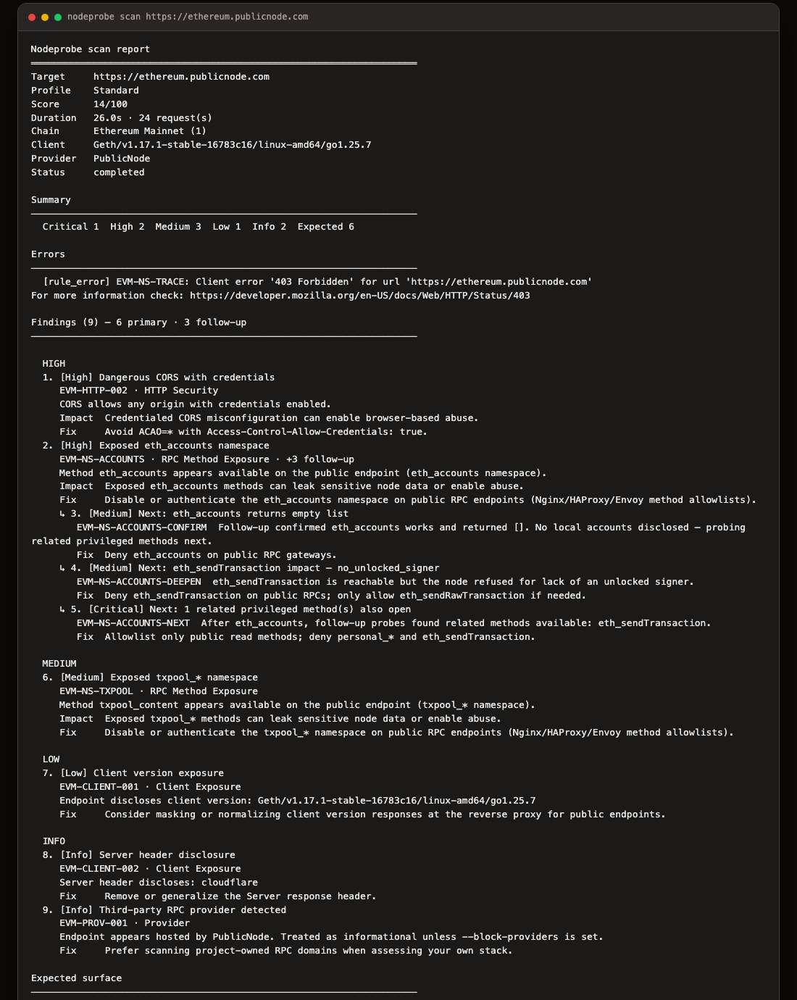
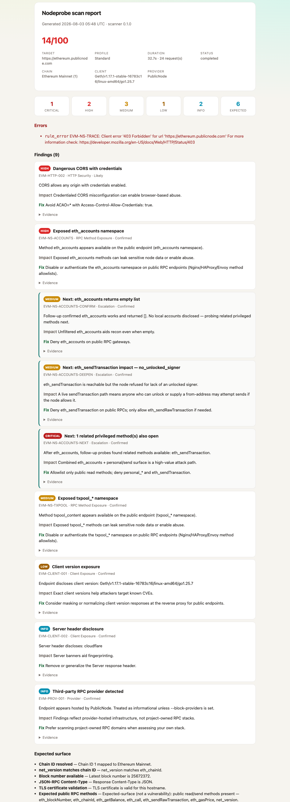
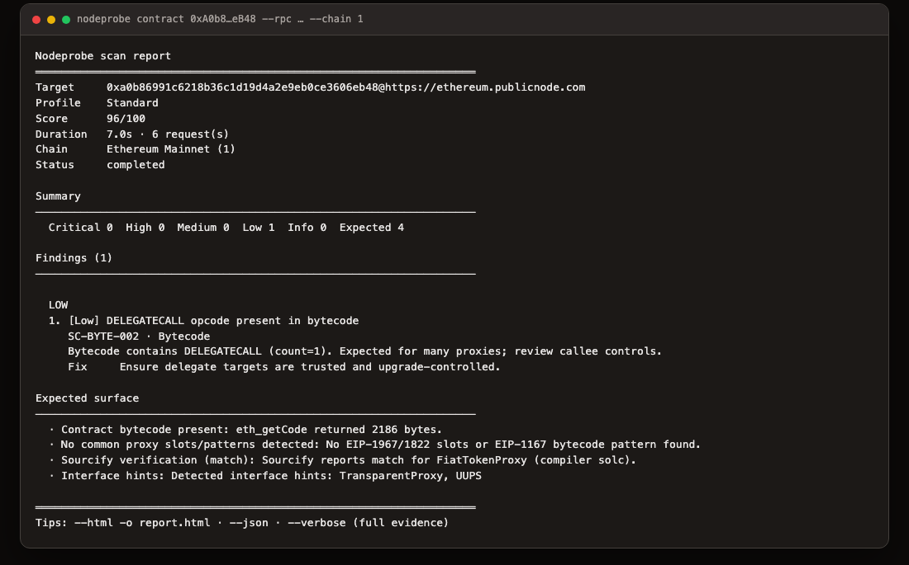
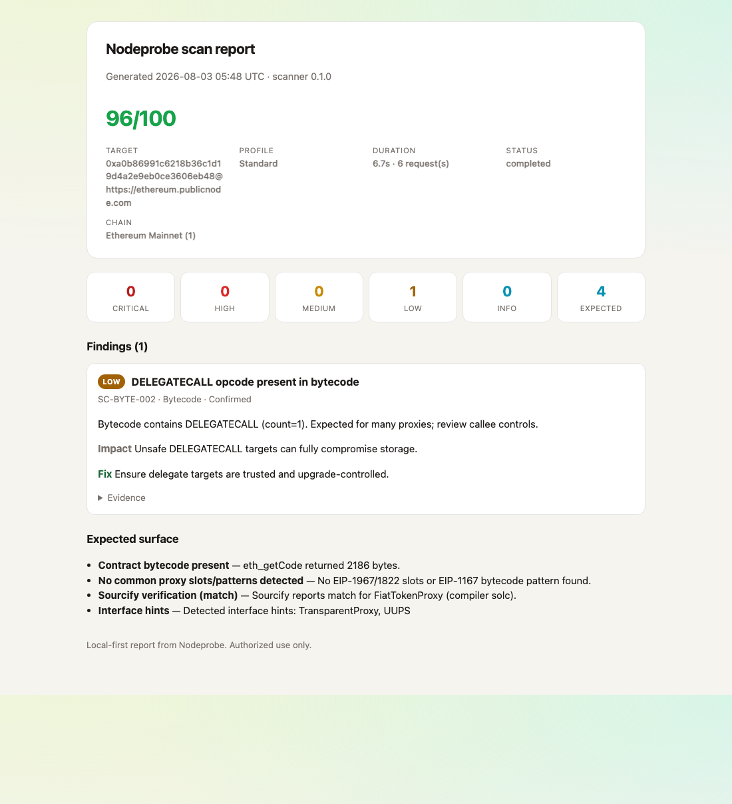

# Nodeprobe

**Probe the surfaces that matter — websites, RPC nodes, and EVM contracts — from your terminal.**

Local-first security scanning for infrastructure you operate or are authorized to assess. No account. No cloud. No telemetry. Just a CLI that talks to the target and prints a readable report.

Default profile is **Standard** for every scan command (web, RPC, and contracts). Use `--profile Quick` for a fast pass, or `--profile Deep` for a larger budget.

```bash
nodeprobe web https://example.com
```

```
Nodeprobe scan report
========================================================================
Target:  https://example.com
Profile:  Standard
Score:  66/100
Duration:  4.1s · 6 request(s)
Status:  completed

Summary
------------------------------------------------------------------------
  Critical 0  High 0  Medium 2  Low 0  Info 1  Expected-surface 1

Findings (5)
------------------------------------------------------------------------
1. [Medium] Missing HSTS header
   WEB-HDR-001 · HTTP Security · Confirmed · escalated → WEB-HDR-001-CONFIRM
   Response from https://example.com does not include HSTS.
   Impact: Missing headers increase risk of clickjacking, XSS amplification, and downgrade attacks.
   Fix:    Set HSTS (and related browser security headers) at the edge.

   ↳ 2. [Info] Next: HTTP redirects to HTTPS
     WEB-HDR-001-CONFIRM · Escalation · Confirmed · from WEB-HDR-001
      Probed http://example.com/ → https://example.com/.
      Redirect exists, but HSTS is still missing (first-visit / MITM risk).

3. [Medium] Missing Content-Security-Policy header
   WEB-HDR-001 · HTTP Security · Confirmed · escalated → WEB-HDR-001-NEXT
   Response from https://example.com does not include Content-Security-Policy.

   ↳ 4. [Medium] Next: no CSP and no frame controls
     WEB-HDR-001-NEXT · Escalation · Confirmed · from WEB-HDR-001
      Neither CSP frame-ancestors nor X-Frame-Options is set.

5. [Info] server header discloses technology
   WEB-HDR-002 · HTTP Security · Confirmed
   Response includes `server: cloudflare`.

Expected surface (not scored as vulnerabilities)
------------------------------------------------------------------------
  · Website TLS certificate validation: TLS certificate is valid for this hostname.

========================================================================
Tip: use --html -o report.html · --json · --verbose for evidence.
```

On **Standard** (default) and **Deep**, interesting findings trigger *bounded escalation* — extra read-only probes that confirm impact, nested under the parent as `↳ Next:`. **Quick** stays fast and skips that step.

---

## What it covers

| Surface | What Nodeprobe looks at |
|---|---|
| **Web** | TLS, security headers (presence + HSTS/CSP policy grading), `security.txt`, `robots.txt`, server disclosure |
| **RPC** | Protocol **families**: EVM, Solana, Substrate/Polkadot, Cosmos, Aptos, Sui — auto-detect or `--family`; bounded surface checks |
| **Contracts** | EVM code presence, proxies, bytecode heuristics, Sourcify verification (read-only) |

**EVM networks:** there is no per-chain engine. `nodeprobe scan <rpc>` (or `rpc --family evm`) works for **any** EVM chain — Ethereum, L2s, sidechains, appchains. Chain names come from a bundled [Chainlist](https://chainid.network) snapshot when the `chainId` is known; unknown IDs still scan with a generic name. You only need a new scanner when the **protocol** is not EVM (e.g. Solana, Cosmos, Aptos, Sui).

**Sui:** Nodeprobe targets the current GraphQL RPC API. Sui Foundation mainnet fullnodes disabled the deprecated JSON-RPC API in July 2026.

### Web header grading

Missing headers still matter — and when HSTS or CSP **is** present, Nodeprobe grades the policy:

- **HSTS** — short / missing `max-age`, missing `includeSubDomains`, `preload` without a preload-ready policy
- **CSP** — `unsafe-inline` / `unsafe-eval`, overly broad sources (`*` / scheme-only), `data:` scripts, missing `frame-ancestors`

Rules: `WEB-HDR-003` (weak HSTS), `WEB-HDR-004` (weak CSP). On **Standard** / **Deep**, weak policies can escalate like missing ones.

### Solana / Cosmos method discovery

Sensitive methods are probed by presence (no expensive payloads), gated by profile:

- **Solana** — admin / costly surface (`validatorExit`, `setLogFilter`, `requestAirdrop`, `getProgramAccounts`, …) plus Deep inventory (`SOL-DISC-003`)
- **Cosmos** — unsafe Tendermint APIs (dial / flush / CPU & heap profilers) and disclosure methods (`dump_consensus_state`, …) plus Deep inventory (`COS-DISC-003`)

Sibling confirmation on **Standard** / **Deep** follows the same pattern as EVM namespace escalation.

Scores, severity counts, and concrete fixes land in a human report by default. Prefer machines? `--json --pretty`.

---

## Install

Python **3.10+**.

```bash
git clone https://github.com/ehsanhajian/nodeprobe.git
cd nodeprobe/scanner
python3 -m venv .venv && source .venv/bin/activate
pip install -e ".[dev]"
```

Then:

```bash
nodeprobe --help
nodeprobe profiles
```

---

## Quick start

All of these use **Standard** by default (escalation enabled). Pass `--profile Quick` or `--profile Deep` to override.

```bash
# Website
nodeprobe web https://example.com

# EVM RPC — any EVM chain (Ethereum, Base, Arbitrum, Astar, …); same command
nodeprobe scan https://rpc.example.com
nodeprobe rpc https://rpc.example.com --family evm

# Other protocol families (not EVM)
nodeprobe rpc https://api.mainnet-beta.solana.com
nodeprobe substrate https://rpc.polkadot.io
nodeprobe cosmos https://rpc.cosmos.directory:443
nodeprobe aptos https://fullnode.mainnet.aptoslabs.com/v1
nodeprobe sui https://graphql.mainnet.sui.io/graphql

# Contract (read-only eth_call / code fetch) — any EVM chainId
nodeprobe contract 0x… --rpc https://rpc.example.com --chain 1
```

### Example reports

Live Standard-profile scans against a public Ethereum RPC and the USDC proxy (`0xA0b8…eB48`) on mainnet.

**RPC — CLI**

```bash
nodeprobe scan https://ethereum.publicnode.com
```



**RPC — HTML** (`--html -o report.html`)



**Contract — CLI**

```bash
nodeprobe contract 0xA0b86991c6218b36c1d19D4a2e9Eb0cE3606eB48 \
  --rpc https://ethereum.publicnode.com --chain 1
```



**Contract — HTML**



### Commands

| Command | Purpose |
|---|---|
| `nodeprobe web <url>` | HTTP / TLS surface |
| `nodeprobe rpc <url>` | RPC with family auto-detect |
| `nodeprobe scan <url>` | EVM JSON-RPC |
| `nodeprobe solana <url>` | Solana JSON-RPC |
| `nodeprobe substrate <url>` | Substrate / Polkadot JSON-RPC |
| `nodeprobe cosmos <url>` | Cosmos / Tendermint RPC |
| `nodeprobe aptos <url>` | Aptos fullnode REST (`/v1`) |
| `nodeprobe sui <url>` | Sui GraphQL RPC |
| `nodeprobe contract <addr> --rpc <url> [--chain <id>]` | EVM contract posture |
| `nodeprobe profiles` | Show profile budgets |
| `nodeprobe rules [--module all]` | Rule catalog |

### Profiles

| Profile | When to use it |
|---|---|
| `Quick` | Fast pass — no escalation |
| `Standard` | **Default** — assessment + confirmation probes |
| `Deep` | Larger budget, richer follow-ups |

Legacy aliases still work: `Free` → `Quick`, `Outbound` → `Standard`, `Authorized-Full` → `Deep`.

### Output

```bash
nodeprobe web https://example.com                 # compact human report (Standard)
nodeprobe web https://example.com --verbose       # include evidence on every finding
nodeprobe web https://example.com --html -o report.html
nodeprobe web https://example.com --json --pretty # machine JSON
nodeprobe web https://example.com --no-color      # plain text
nodeprobe web https://example.com --profile Quick # fast pass, no escalation
```

Open `report.html` in a browser for a shareable, scannable view when the terminal report gets long.

Exit code **`2`** means blocked or aborted (unsafe target, kill switch, unknown RPC family, `--block-providers`, …).

---

## Safety by design

Nodeprobe is built to *look*, not to break things.

- Blocks SSRF paths: private IPs, localhost, cloud metadata
- Enforces per-profile request, RPS, and duration budgets
- Kill switch: touch `/tmp/nodeprobe-kill` or set `NODEPROBE_KILL_SWITCH`
- Escalation confirms impact — no exploit payloads, no funded transactions
- Chain names from a bundled [Chainlist](https://chainid.network) snapshot

**Authorized use only.** Scan systems you own or have permission to assess. Unauthorized scanning may be illegal.

---

## Development

```bash
cd scanner
source .venv/bin/activate
pytest -q
```

Everything lives under `scanner/` — engines, rules, and the `nodeprobe` CLI.

---

## Support the project

If Nodeprobe helps you, donations are welcome — **ETH or ERC-20 on Ethereum**:

`0xE5B2f8a35c0f12304c5aBDa9477159b53f622cAA`

---

## License

Proprietary — all rights reserved unless otherwise stated.
